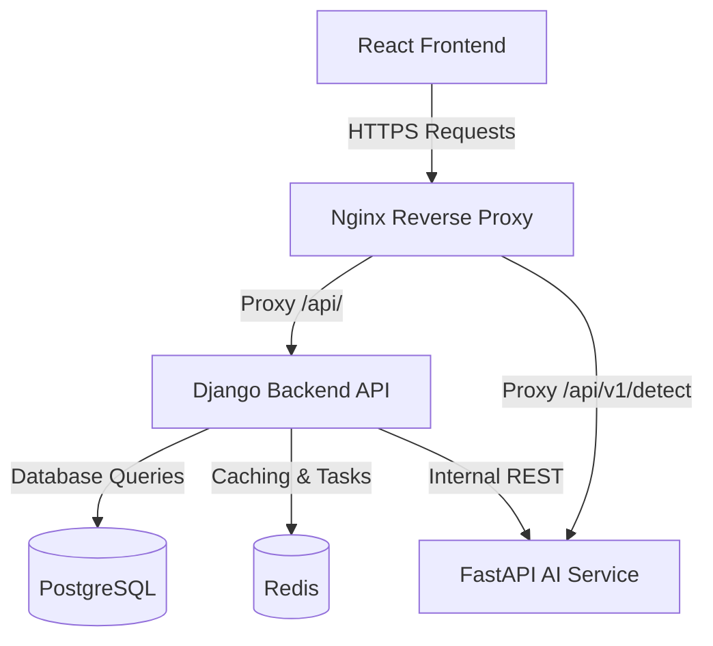

# EcoVerse Platform Architecture

This document describes the design patterns, structure, and integrations of the EcoVerse platform.

---

## 1. Directory Structure

EcoVerse is structured as a containerized monorepo:

```
├── /frontend           # React + TypeScript client (Vite, Tailwind, Sentry)
├── /backend            # Django REST Framework core (PostgreSQL, Redis, Celery)
├── /ai-service         # FastAPI YOLOv8 waste-image classification service
├── /infra              # Orchestration (Docker Compose, Nginx proxy, Prometheus, Grafana)
└── /.github/workflows  # Continuous Integration pipelines
```

---

## 2. Component Diagram



---

## 3. Database Models Design

- **Users app**: Extends AbstractUser with roles (Admin, Municipality, NGO, Volunteer, Citizen, Restaurant, Recycler, Vendor), profiles, carbon scores, and reward points.
- **Waste app**: WasteReport (Citizen submitted, status: Pending/Assigned/Collected/Completed), Timeline events, Comments, and Citizen ratings.
- **Food app**: FoodDonation (Donor, quantity, quality status, expiry, status: Pending Claim/Accepted/Delivered).
- **Marketplace app**: Product (Seller, category, price in points, availability status).
- **Rewards app**: RewardChest (Daily/Epic/Cosmic claims), DailyMission progress, and Stamp (Passport badges).
- **Analytics app**: EnvironmentalImpact (CO2 saved, waste diverted, food rescued aggregates).
- **Notifications app**: Notification logs (Text, read status).
- **AI app**: AIScan audit log (Image, predicted category, confidence score, co2 offset, points awarded).

---

## 4. Security & Throttling Patterns

### Security Headers
- HSTS enabled (31536000 seconds) with preloading.
- Content Type Nosniff header enabled.
- Clickjacking protection via X-Frame-Options set to DENY.
- Cookies configured with HttpOnly and Secure flags.

### Throttling (Redis Backed)
- **Anon / User requests**: 100 requests per minute.
- **Authentication (Login)**: 20 attempts per hour.
- **Password Reset**: 3 attempts per hour.
- **File Uploads**: 10 uploads per minute (overridden on create/complete_cleanup actions).
